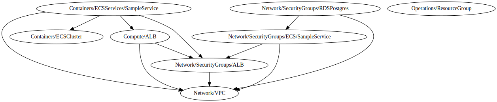

# **Terragrunt AWS ECS Fargate Blueprint**

## **Description**

This project defines a classic architecture pattern in AWS using ECS, ALB, Fargate and network resources 
The template defines an architecture that allows through a load balancer to access containers deployed in an ECS cluster, containers have access to a Postgres database, in addition to these elements, there are network and security resources.

## Architecture diagram

In this image you can watch a multi-avalilability zone deployment in an environment, a **DevSecOps Account for CI/CD tools using CodeCatalyst, a shared Account for ECR images an Github as repository for the source code**.

## Dependency Diagram



# Project structure
```commandline
.
├── README.md
├── common
├── docs
├── infrastructure
├── modules
└── terragrunt.hcl

4 directories, 2 files

```
You will find 4 directories and 2 files:

- **common**: contains the `common.tfvars`, `environment.hcl` file to setup de environment for project and `variables.tf` with de description of common.tfvars, and `common.hcl` with the parameters used for setting providers and tfstate configurations for terragrunt. 
- **docs**: contains documentation, images and more.
- **infrastructure**: contains the infrastructure definitions grouped by layers.
- **modules**: contains local modules if them are necessary. 
- **terragrunt.hcl file** in the root, define the terraform cli behavior, hooks and generate blocks for remote state configuration and provider.tf.

```hcl
locals {
  common_vars = read_terragrunt_config("${get_parent_terragrunt_dir()}/common/common.hcl")
  environment = read_terragrunt_config("${get_parent_terragrunt_dir()}/common/environment.hcl")

}


terraform {
  extra_arguments "init_arg" {
    commands = ["init"]
    arguments = [
      "-reconfigure"
    ]
    env_vars = {
      TERRAGRUNT_AUTO_INIT = true
    }
  }
  extra_arguments "common_vars" {
    commands = get_terraform_commands_that_need_vars()
    arguments = [
      "-var-file=${get_parent_terragrunt_dir()}/common/common.tfvars"
    ]
  }

}

remote_state {
  backend = "s3"
  generate = {
    path      = "remotebackend.tf"
    if_exists = "overwrite_terragrunt"
  }
  config = {
    profile              = local.common_vars.locals.backend_profile
    region               = local.common_vars.locals.backend_region
    bucket               = local.common_vars.locals.backend_bucket_name
    key                  = "${local.common_vars.locals.project_folder}/${local.environment.locals.workspace}/${path_relative_to_include()}/${local.common_vars.locals.backend_key}"
    dynamodb_table       = local.common_vars.locals.backend_dynamodb_lock
    encrypt              = local.common_vars.locals.backend_encrypt

  }
}

generate = local.common_vars.generate
```
```commandline
tree -L 5
.
├── README.md
├── common
│   ├── common.hcl
│   ├── common.tfvars
│   ├── environment.hcl
│   └── variables.tf
├── docs
│   ├── README.md
│   └── images
├── infrastructure
│   ├── Compute
│   │   └── ALB
│   │       ├── README.md
│   │       ├── graph.svg
│   │       └── terragrunt.hcl
│   ├── Containers
│   │   ├── ECSCluster
│   │   │   ├── README.md
│   │   │   ├── graph.svg
│   │   │   └── terragrunt.hcl
│   │   └── ECSServices
│   │       └── SampleService
│   │           ├── README.md
│   │           ├── graph.svg
│   │           └── terragrunt.hcl
│   ├── Network
│   │   ├── SecurityGroups
│   │   │   ├── ALB
│   │   │   │   ├── README.md
│   │   │   │   ├── graph.svg
│   │   │   │   └── terragrunt.hcl
│   │   │   └── ECS
│   │   │       └── SampleService
│   │   └── VPC
│   │       ├── README.md
│   │       ├── graph.svg
│   │       └── terragrunt.hcl
│   ├── Operations
│   │   └── ResourceGroup
│   │       ├── README.md
│   │       ├── graph.svg
│   │       └── terragrunt.hcl
│   └── graph.svg
├── modules
│   └── Resource_Groups
│       ├── README.md
│       ├── main.tf
│       ├── outputs.tf
│       └── variables.tf
└── terragrunt.hcl

```
## How to use

1- Replace recursively the values using your ide or shell script, for example: 
```
project_name = "#{project}#"
dev = "#{environment}#"
us-east-2 = "#{backend_region}#"
db-lock = "#{dynamodb_backend}#"
my_backend_bucket = "#{backend_bucket}#"
us-east-2 = "#{backend_region}#"
```
2- Setup your profiles for remote stated and deployment in `common/common.hcl` and `common.tfvars`

3- Go to infrastructure path and run terragrunt commands:

```commandline
$ cd infrastructure
$ TF_VAR_env=dev terragrunt run-all plan
```
