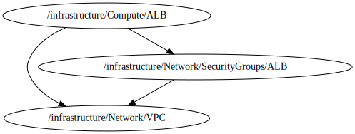

<!-- BEGIN_TF_DOCS -->

 #  ALB for Services
 * This file creates a custom ALB  based on **terraform-aws-modules/alb/aws**
 ## Source Module info
 - **version**: = "8.7.0"
 - **Link**:  [terraform-aws-modules/alb/aws](github.com/terraform-aws-modules/alb/aws)

## Code Dependencies Graph
<center>



##### **Dependency Graph**

</center>

---

## Example parameter options for each environment

```hcl
include "root" {
  path   = find_in_parent_folders()
  expose = true
}

dependency "vpc" {
  config_path  = "${get_parent_terragrunt_dir("root")}/infrastructure/Network/VPC"
  mock_outputs = {
    vpc_id = "vpc-04e3e1e302f8c8f06"
    public_subnets = ["subnet-0f37739f11ebd1234", "subnet-0f37739f11ebd1235"]
  }
  mock_outputs_merge_strategy_with_state = "shallow"
}

dependency "sg_alb" {
  config_path  = "${get_parent_terragrunt_dir("root")}/infrastructure/Network/SecurityGroups/ALB"
  mock_outputs = {
    security_group_id = "sg-02092eea015a2eade"
  }
  mock_outputs_merge_strategy_with_state = "shallow"
}

# dependency "acm" {
#   config_path = "${get_parent_terragrunt_dir()}/resources/Security/CertificateManager"
#   mock_outputs = {
#     acm_certificate_arn = "arn:aws:acm:us-east-1:123456789012:certificate/12345678-1234-1234-1234-123456789012"
#   }
#   mock_outputs_merge_strategy_with_state = "shallow"
# }

locals {
  environment = read_terragrunt_config(".environment.hcl",read_terragrunt_config(find_in_parent_folders("common/environment.hcl")))

  env = {
    default = {
      create_lb                        = false
      name                             = "${include.root.locals.environment.locals.workspace}-${include.root.locals.common_vars.locals.project}-alb"
      load_balancer_type               = "application"
      internal                         = false
      drop_invalid_header_fields       = true
      enable_cross_zone_load_balancing = true
      target_groups                    = [
        {
          name_prefix          = "demo-"
          backend_protocol     = "HTTP"
          backend_port         = 80
          target_type          = "ip"
          deregistration_delay = 10
          health_check         = {
            enabled             = true
            path                = "/"
            interval            = 30
            healthy_threshold   = 5
            unhealthy_threshold = 5
            timeout             = 10
            protocol            = "HTTP"
            matcher             = "200-399"
          }
        }
      ]
      http_tcp_listeners = [
        {
          port               = 80
          protocol           = "HTTP"
          target_group_index = 0
        }
      ]
      https_listeners = [
        # {
        #   port               = 443
        #   protocol           = "HTTPS"
        #   ssl_policy         = "ELBSecurityPolicy-2016-08"
        #   certificate_arn    = var.acm_certificate_arn
        #   target_group_index = 0
        # }
      ]
      http_tcp_listener_rules = []
      https_listener_rules    = []
      tags                    = {
        Environment = include.root.locals.environment.locals.workspace
        Layer       = "Application"
      }
    }
    "#{environment}#" = {
      create_lb = true
    }
  }
  environment_vars = contains(keys(local.env), include.root.locals.environment.locals.workspace) ? include.root.locals.environment.locals.workspace : "default"
  workspace        = merge(local.env["default"], local.env[local.environment_vars])
}
terraform {
  source = "tfr:///terraform-aws-modules/alb/aws?version=8.7.0"

}


inputs = {


  create_lb          = local.workspace["create_lb"]
  name               = local.workspace["name"]
  vpc_id             = dependency.vpc.outputs.vpc_id
  load_balancer_type = local.workspace["load_balancer_type"]

  internal                   = local.workspace["internal"]
  drop_invalid_header_fields = local.workspace["drop_invalid_header_fields"]


  subnets                          = dependency.vpc.outputs.public_subnets
  security_groups                  = [dependency.sg_alb.outputs.security_group_id]
  enable_cross_zone_load_balancing = local.workspace["enable_cross_zone_load_balancing"]

  target_groups = local.workspace["target_groups"]

  http_tcp_listeners      = local.workspace["http_tcp_listeners"]
  http_tcp_listener_rules = local.workspace["http_tcp_listener_rules"]

  https_listeners      = local.workspace["https_listeners"]
  https_listener_rules = local.workspace["https_listener_rules"]

  tags = local.workspace["tags"]
  #acm_certificate_arn    = dependency.acm.outputs.acm_certificate_arn
}
```
<!-- END_TF_DOCS -->