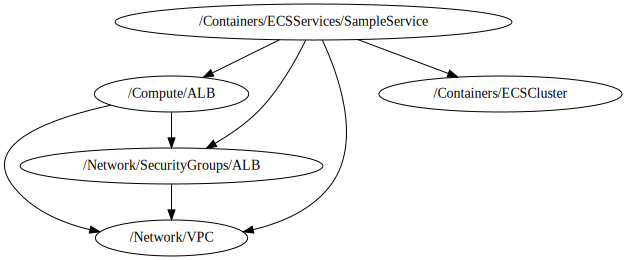

<!-- BEGIN_TF_DOCS -->

 # Sample Service
 * This file creates a sample Service based on **terraform-aws-modules/ecs/aws//modules/service**
 * This service use the public image **public.ecr.aws/ecs-sample-image/amazon-ecs-sample:latest**
 ## Source Module info
- **version**: = "5.2.0"
- **Link**:  [terraform-aws-modules/ecs/aws//modules/service](github.com/terraform-aws-modules/ecs/aws/)

## Code Dependencies Graph
<center>



##### **Dependency Graph**

</center>

---

## Example parameter options for each environment

```hcl
include "root" {
  path   = find_in_parent_folders()
  expose = true
}

dependency "sg_alb" {
  config_path  = "${get_parent_terragrunt_dir("root")}/infrastructure/Network/SecurityGroups/ALB"
  mock_outputs = {
    security_group_id = "sg-02092eea015a2eade"
  }
  mock_outputs_merge_strategy_with_state = "shallow"
}

dependency "alb" {
  config_path  = "${get_parent_terragrunt_dir("root")}/infrastructure/Compute/ALB"
  mock_outputs = {
    target_group_arns = [
      "arn:aws:elasticloadbalancing:eu-west-1:123456789012:targetgroup/bluegreentarget1/209a844cd01825a4"
    ]
  }
  mock_outputs_merge_strategy_with_state = "shallow"
}


dependency "ecs_cluster" {
  config_path  = "${get_parent_terragrunt_dir("root")}/infrastructure/Containers/ECSCluster"
  mock_outputs = {
    cluster_arn = "arn:aws:ecs:us-east-1:123456789012:cluster/panther-web-cluster"
  }
  mock_outputs_merge_strategy_with_state = "shallow"
}

dependency "vpc" {
  config_path  = "${get_parent_terragrunt_dir("root")}/infrastructure/Network/VPC"
  mock_outputs = {
    vpc_id         = "vpc-04e3e1e302f8c8f06"
    public_subnets = [
      "subnet-0e4c5aedfc2101502",
      "subnet-0d5061f70b69eda14",
    ]
  }
  mock_outputs_merge_strategy_with_state = "shallow"
}


locals {
  # manage workspaces
  environment = read_terragrunt_config(".environment.hcl", read_terragrunt_config(find_in_parent_folders("common/environment.hcl")))

  # Define parameters for each workspace
  env = {
    default = {
      create                      = false
      name                        = "sample-${include.root.locals.environment.locals.workspace}"
      assign_public_ip            = true
      create_tasks_iam_role       = true
      create_cloudwatch_log_group = true
      create_task_exec_iam_role   = true
      task_exec_iam_role_name     = "${include.root.locals.environment.locals.workspace}-${include.root.locals.common_vars.locals.project}-ecs-role"
      task_exec_iam_role_policies = { logs_full = "arn:aws:iam::aws:policy/CloudWatchLogsFullAccess" }
      cpu                         = 256
      memory                      = 512

      tags = {
        Environment = include.root.locals.environment.locals.workspace
        Layer       = "Application"
      }
    }
    "#{environment}#" = {
      create = true


      cpu    = 256
      memory = 512


    }

  }
  environment_vars = contains(keys(local.env), include.root.locals.environment.locals.workspace) ? include.root.locals.environment.locals.workspace : "default"
  workspace        = merge(local.env["default"], local.env[local.environment_vars])
}


terraform {
  source = "tfr:///terraform-aws-modules/ecs/aws//modules/service?version=5.2.0"

}

inputs = {
  create = local.workspace["create"]

  sg_alb_id   = dependency.sg_alb.outputs.security_group_id
  cluster_arn = dependency.ecs_cluster.outputs.cluster_arn

  name = local.workspace["name"]

  cpu                   = local.workspace["cpu"]
  memory                = local.workspace["memory"]
  assign_public_ip      = local.workspace["assign_public_ip"]
  container_definitions = {
    ecs-sample = {
      cpu    = 256
      memory = 512

      essential     = true
      image         = "public.ecr.aws/ecs-sample-image/amazon-ecs-sample:latest"
      port_mappings = [
        {
          name          = "ecs-sample"
          containerPort = 80
          protocol      = "tcp"
        }
      ]

      # Example image used requires access to write to root filesystem
      readonly_root_filesystem  = false
      enable_cloudwatch_logging = true
      log_configuration         = {
        logDriver = "awslogs"
        options   = {

          awslogs-group : "amazon-ecs-sample"
          awslogs-region : "#{backend_region}#"
          awslogs-create-group : "true"
          awslogs-stream-prefix : "sample"


        }
      }
    }
  }

  task_exec_iam_role_name     = local.workspace["task_exec_iam_role_name"]
  create_task_exec_iam_role   = local.workspace["create_task_exec_iam_role"]
  task_exec_iam_role_policies = local.workspace["task_exec_iam_role_policies"]
  subnet_ids                  = dependency.vpc.outputs.public_subnets
  load_balancer               = {
    service = {
      target_group_arn = dependency.alb.outputs.target_group_arns[0]
      #"arn:aws:elasticloadbalancing:eu-west-1:1234567890:targetgroup/bluegreentarget1/209a844cd01825a4"
      container_name   = "ecs-sample"
      container_port   = 80
    }
  }

  security_group_rules = {
    alb_ingress = {
      type                     = "ingress"
      from_port                = 80
      to_port                  = 80
      protocol                 = "tcp"
      description              = "Service port"
      source_security_group_id = dependency.sg_alb.outputs.security_group_id
    }
    egress_all = {
      type        = "egress"
      from_port   = 0
      to_port     = 0
      protocol    = "-1"
      cidr_blocks = ["0.0.0.0/0"]
    }
  }

  tags = local.workspace["tags"]

}
```
<!-- END_TF_DOCS -->