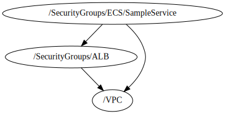

<!-- BEGIN_TF_DOCS -->

 # Security Group for Sample Service
 * This file creates a custom Security group for Sample Service  based on **terraform-aws-modules/security-group/aws**
 ## Source Module info
 - **version**: = "5.1.0"
 - **Link**:  [terraform-aws-modules/security-group/aws](github.com/terraform-aws-modules/security-group/aws)

## Code Dependencies Graph
<center>



##### **Dependency Graph**

</center>

---

## Example parameter options for each environment

```hcl
include "root" {
  path = find_in_parent_folders()
  expose = true
}

dependency "vpc" {
  config_path = "${get_parent_terragrunt_dir("root")}/infrastructure/Network/VPC"
  mock_outputs = {
    vpc_id = "vpc-04e3e1e302f8c8f06"
  }
  mock_outputs_merge_strategy_with_state = "shallow"
}

dependency "sg_alb" {
  config_path = "${get_parent_terragrunt_dir("root")}/infrastructure/Network/SecurityGroups/ALB"
  mock_outputs = {
    security_group_id = "sg-0417d4404d84892fa"
  }
  mock_outputs_merge_strategy_with_state = "shallow"
}

locals {
environment = read_terragrunt_config(".environment.hcl",read_terragrunt_config(find_in_parent_folders("common/environment.hcl")))

  env = {
    default = {
      create                   = false
      name                     = "${include.root.locals.environment.locals.workspace}-${include.root.locals.common_vars.locals.project}-ecs-sg"
      description              = "Security group for service with HTTP ports open for ALB"

      use_name_prefix          = false
      ingress_with_cidr_blocks = []
      egress_with_cidr_blocks = [
        {
          rule        = "all-tcp"
          cidr_blocks = "0.0.0.0/0"
        }
      ]

      egress_with_source_security_group_id = []
      tags = {
        Environment = include.root.locals.environment.locals.workspace
        Layer = "Networking"
      }
    }
    "#{environment}#" = {
      create = true
    }
  }
  environment_vars = contains(keys(local.env),  include.root.locals.environment.locals.workspace) ? include.root.locals.environment.locals.workspace : "default"
  workspace        = merge(local.env["default"], local.env[local.environment_vars])
}
terraform {
  source = "tfr:///terraform-aws-modules/security-group/aws?version=5.1.0"

}
inputs = {
  vpc_id                     = dependency.vpc.outputs.vpc_id
  security_groups_in_service = dependency.sg_alb.outputs.security_group_id


  create          = local.workspace["create"]
  name            = local.workspace["name"]
  description     = local.workspace["description"]
  use_name_prefix = local.workspace["use_name_prefix"]

  ingress_with_cidr_blocks = local.workspace["ingress_with_cidr_blocks"]
  egress_with_cidr_blocks  = local.workspace["egress_with_cidr_blocks"]

 ingress_with_source_security_group_id = [
        {
          from_port                = 80
          to_port                  = 80
          protocol                 = "tcp"
          description              = "Security Groups for inbound traffic to service"
          source_security_group_id = dependency.sg_alb.outputs.security_group_id
        }
      ]
  egress_with_source_security_group_id  = local.workspace["egress_with_source_security_group_id"]

  tags = local.workspace["tags"]
}
```
<!-- END_TF_DOCS -->